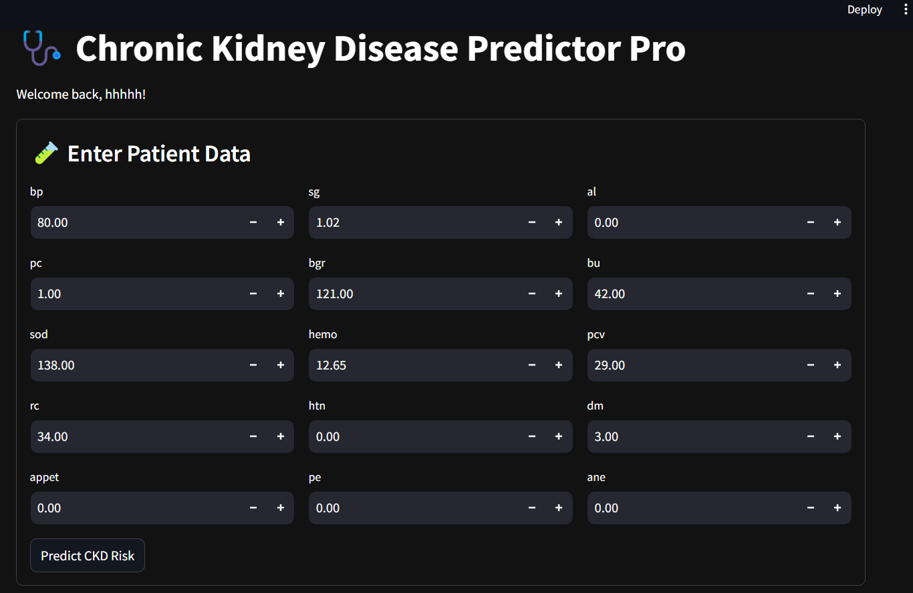

# CKD Predictor Pro

  
Chronic Kidney Disease prediction system with explainable AI and secure user authentication.

## Features

### Authentication
- User registration with email validation
- Secure password hashing (SHA-256)
- Login/logout functionality
- Session management

### Prediction Engine
- Dual-model approach (Random Forest + XGBoost)
- SHAP value explanations for predictions
- Confidence visualization
- Feature importance analysis

### Dashboard & Data Management
- Interactive input forms for patient data
- Real-time prediction results
- Model performance metrics and comparison (accuracy, precision, recall, F1, AUC)
- Confusion matrices for both models
- Data exploration tools (raw data, feature distributions)
- **Automatic storage of each patient’s input and prediction in a secure database**
- **View all saved patient records directly in the app**
- Mobile-responsive design

## Installation

### Prerequisites
- Python 3.8+
- pip package manager

1. Clone the repository:
    ```bash
    git clone https://github.com/yourusername/Chronic-disease-project.git
    cd Chronic-disease-project
    pip install -r requirements.txt
    ```

## Usage

Run the application:
```bash
streamlit run ckd_predictor_app.py
```

- Open the displayed local URL in your browser.
- Register or log in to use the app.
- Enter patient data, view predictions, and explore or download saved records.